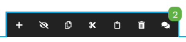

# Prgfx.Neos.ContentCommentAnnotations

This plugin adds an indicator for `networkteam/contentcomments` comments to the node toolbar.
Clicking the toolbar button will try to bring up the comments in the inspector tab.



**This package for now is more of a proof of concept!**

```
composer require prgfx/neos-contentcomment-annotation:@dev
```

## Notes
Depending on your rendering you may need to add a stylesheet.
As the node toolbar is rendered in the guestframe, the CSS has to be included on your page.
You can use (or override) the `Prgfx.Neos.ContentCommentAnnotation:InlineStyles` prototype, which is included in the `Neos.Neos:Page` by default.
